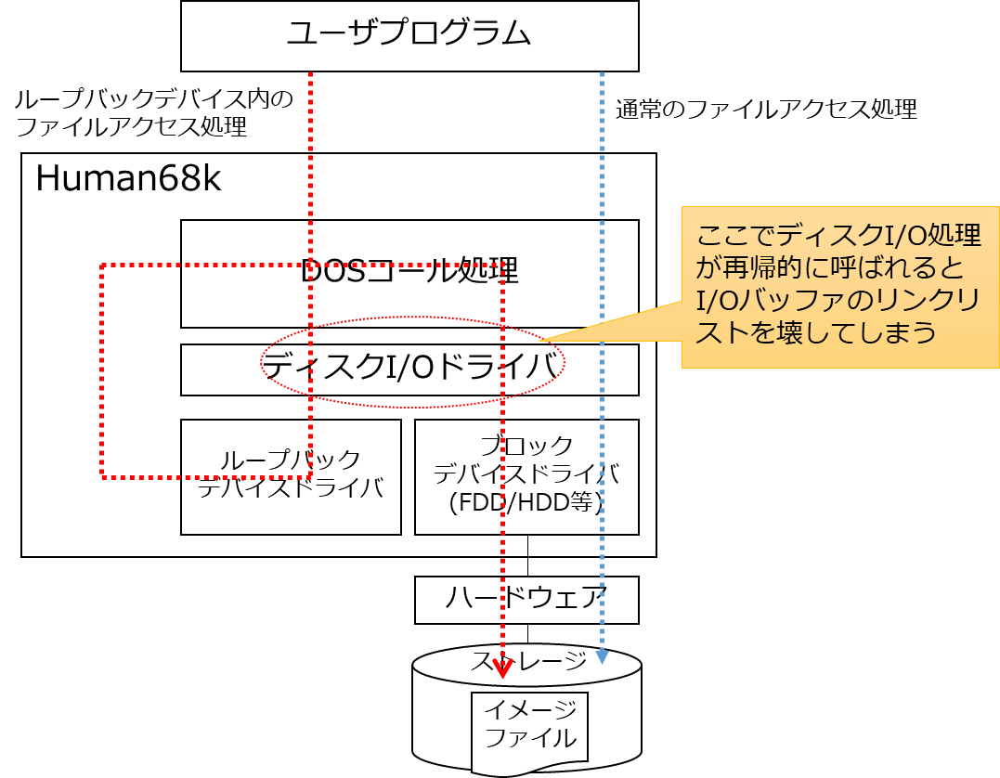

ループバックデバイスドライバの内部処理について
=========================================

## ディスクI/Oドライバ処理の修正

Human68k の通常のファイルアクセスは、DOS コールの処理ルーチンがファイルシステムの解釈を行い、ディスクI/Oドライバを通してセクタをの読み書きを行います。
ディスクI/OドライバはI/Oバッファキャッシュの管理も行っていて(CONFIG.SYSのBUFFERS=で指定した数のバッファがここで管理されます)、既にデータがバッファ上にあればそれを利用し、なければブロックデバイスドライバを呼んで、ディスクドライブなどのデータの読み書きを行います (下図の青点線)。

ループバックデバイスの原理はシンプルで、ディスクI/Oドライバからのデータ要求に対してデバイスをアクセスする代わりに、他のドライブのファイルシステム上にあるファイルをアクセスしているだけです。
デバイスドライバの中からはDOS _SEEK, _READ, _WRITEといったDOSコールが呼び出され、既にオープンされているイメージファイルの内容をディスクのセクタに見立てて読み書きを行います (下図の赤点線)。

ここで問題になるのが、ループバックデバイスのアクセスによって、ディスクI/Oドライバのデータ読み書き処理の中から再帰的に同じディスクI/Oドライバが呼び出されてしまうことです。
ディスクI/OドライバはI/Oバッファキャッシュを双方向リンクリストで管理しているのですが、アクセスの最中にリストの繋ぎ変えが発生するため、再帰的に呼び出されることで繋ぎ変え途中のリンクリストが書き換えられ、結果としてバッファのリンクリストが壊れてしまいます。

loopdrv.sys ではこのような事態を防ぐため、Human68k オリジナルのディスクI/Oドライバの一部を差し替えて、再帰呼び出し時にも正常に動作するようにしています。
FASTIO.X のようなディスクI/Oドライバはこの処理を丸ごと外部のものと差し替えてしまうため、loopdrv.sys との共存ができないわけです。

## イメージファイルのファイルディスクリプタ

ループバックマウントしたイメージファイルは、マウントされている間ずっとファイルがオープンされたままになっています。
loopdrv.sys 自身はファイルのオープンを行わず、ただ与えられたファイルディスクリプタへのアクセスを行うのみで、ファイルオープンは losetup.x が行います。

通常、プロセスがオープンしたファイルはそのプロセスが終了する際にすべてクローズされてしまいますが、losetup.x はそれを避けるため、終了前に自身のプロセス管理ポインタ (PSP) に格納されている「プロセスのファイルハンドラの使用状況」ビットを0に落とすことで、プロセス終了後もファイルがオープンされたままになるようにしています。

Human68k はファイルハンドラの使用状況を各プロセスごとだけでなくOS全体でも別途管理しているため、オープンされたままのディスクリプタが他のファイルオープンによって使われることはありません。
ただし、Human68kはシングルタスクOSでプロセス間のファイルハンドラの保護も特に行っていないため、ディスクリプタ値を直接指定することで他のプロセスがオープン中したファイルを勝手に読み書きやクローズすることもできてしまうので、注意が必要です。

## 参考文献

* [ぷにぐらま～ずまにゅある](https://github.com/kg68k/puni) by 立花@桑島技研 氏
  * [fs_ospatch.txt](https://github.com/kg68k/puni/blob/main/fs_ospatch.txt)
  * [oswork.txt](https://github.com/kg68k/puni/blob/main/oswork.txt)
